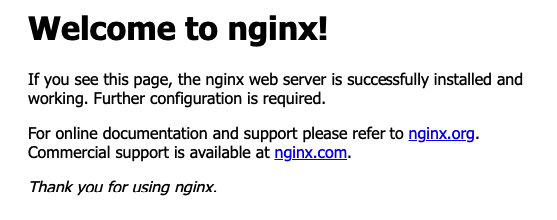

# 01_09 Challenge: Set up an NGINX server on Ubuntu Linux

## Scenario
A web developer on your team has just completed the design for a new website.  It works perfectly on their laptop and now they want to share it with the rest of the team from a web server that everyone can access.

Set up an NGINX server for the new website.  Once the server is in place, the developer will take it from there to upload the final design for the website.

## Requirements
1. Start with a server running the latest version of Ubuntu.  Use the cloud platform of your choice or a VM running on your local system.
1. As the root user:
    1. Update the operating system package definitions
    1. Install the latest version of NGINX.
    ```
    sudo su -
    apt update
    apt install -y nginx
    ```
1. As the root user, use the command line interface to:
    1. Confirm the NGINX service is running.
    1. Test the default configuration.
    ```
    systemctl status nginx --no-pager
    nginx -t
    ```
1. Check the installation by viewing the webiste URL in a browser.  The page should show content similar to the following image:


